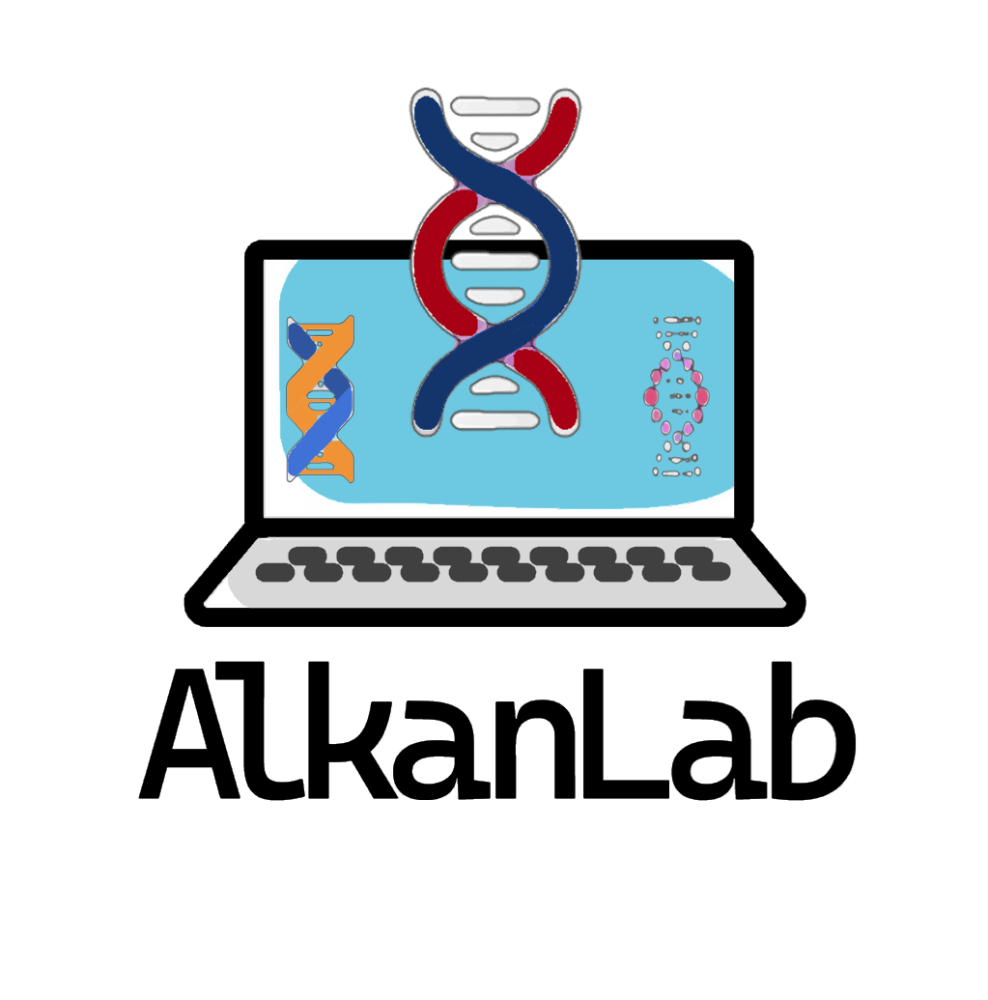

  <!-- Image container -->
  

    
  

  <!-- Text container -->
  

    <h1>CS 481/583: Bioinformatics Algorithms</h1>
    
Bilkent University, Spring 2026

  

more like: (bio)informatics **ALGORITHMS**

**Instructor:** [Can Alkan](https://cs.bilkent.edu.tr/~calkan/)

**Class Hours:** Tue 13:30-15:20 - Fri 09:30-10:20. 

**Class room:** TBA

**Office hour:** By appointment ([Public calendar](http://cs.bilkent.edu.tr/~calkan/calendar.html), changes frequently)

**Staff contact:** [Staff](https://www.alkanlab.org/bioinformatics-algorithms/staff)

---
**NOTE:** Some biology, molecular biology, genetics background would help, but not required. Note that this course is, before everything else, an **algorithms course** and focuses mainly on string processing.
---

**Prerequisites:** Discrete mathematics, basic algorithms and data structures, and programming proficiency with **compiled languages**, e.g., C/C++/Java/Rust will be expected. Students will be assumed to have the necessary knowledge of combinatorics, fundamental algorithms for sorting, searching, hashing, dynamic programming, greedy algorithms, graph algorithms, and run time and space analyses (i.e., growth functions - described using the Big *O* notation).

**Textbook:** None mandatory, [some recommended material](https://www.alkanlab.org/bioinformatics-algorithms/materials)

**Grading:** There will be one midterm exam (25%) and a final exam (35%). A further 30% of the final grade will be based on homework/programming assignments, and 10% will be based on quizzes.

**Grading Policy:** Note that we do not discuss with students about grades. Therefore, we will not answer any questions about the passing grades and/or students' requests for passing the course. Any emails sent to this effect will be omitted.

---

**Course Slides:** [CHECK HERE](https://www.alkanlab.org/bioinformatics-algorithms/slides)

---

**Key Dates (tentative, subject to change)**:
  - Midterm:  March 31, 2026 -- during class hours
  - Quizzes:
    - Quiz 1: February 10, 2026
    - Quiz 2: March 3, 2026
    - Quiz 3: March 24, 2026
    - Quiz 4: April 14, 2026
    - Quiz 5: May 5, 2026
  - Homeworks:
    - HW0:
      - Assigned: February 6, 2026
      - Deadline: February 13, 2026
    - HW1:
      - Assigned: February 16, 2026
      - Deadline: February 27, 2026
    - HW2:
      - Assigned: March 6, 2026
      - Deadline: March 25, 2026
    - HW3:
      - Assigned: March 30, 2026
      - Deadline: April 10, 2026
    - HW4:
      - Assigned: April 14, 2026
      - Deadline: April 24, 2026
    - HW5:
      - Assigned: April 29, 2026
      - Deadline: May 8, 2026

---

**Lecture Cancellations:** The following lectures are canceled. 

<ul style="padding-left: 50px;">
  <li>March 31, 2026</li>
</ul>

**Important information for exams**:
<ul style="padding-left: 50px;">
  <li>You will be given the opportunity to bring cheat sheet to the midterm and final exams (not the quizzes). DO NOT try to memorize anything, instead grasp the logic behind each algorithm & data structure.</li>
  <li>Write legibly, and make your answers clear.</li>
  <li>Unintelligible answers may fail to receive credit.</li>
  <li>In the case of a "design an algorithm" question, you are expected to give only pseudocode. Any "real" code may not be graded.</li>
</ul>

**Frequently Asked Questions**: [Here](https://www.alkanlab.org/bioinformatics-algorithms/faq)
