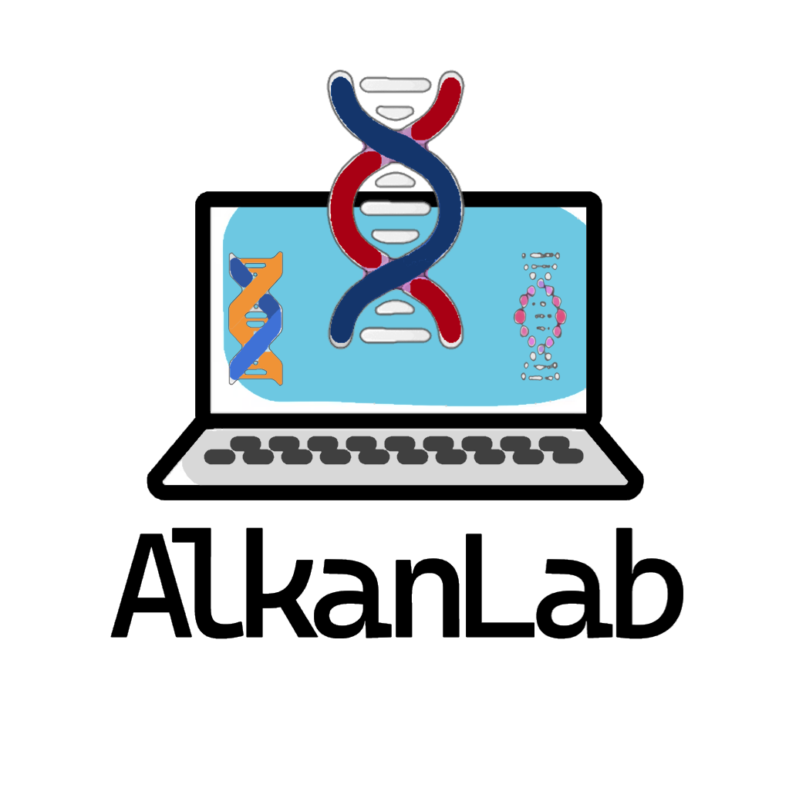

  <!-- Image container -->
  

    
  

  <!-- Text container -->
  

    <h1>CS 481/583: Bioinformatics Algorithms</h1>
    
Bilkent University, Spring 2025

  

more like: (bio)informatics **ALGORITHMS**

**Instructor:** [Can Alkan](https://cs.bilkent.edu.tr/~calkan/)

**Class Hours:** Tue 13:30-15:20 - Fri 09:30-10:20

**Class room:** B-Z08

**Office hour:** By appointment ([Public calendar](http://cs.bilkent.edu.tr/~calkan/calendar.html), changes frequently)

**Staff contact:** [Staff](https://www.alkanlab.org/bioinformatics-algorithms/staff)

---
**NOTE:** Some biology, molecular biology, genetics background would help, but not required. Basics regarding the topic will be covered in class.

---

**Prerequisites:** Elementary discrete mathematics, basic algorithms and data structures, and programming proficiency with, e.g., C/C++/Java will be expected. Knowledge of elementary combinatorics and probability, fundamental algorithms for sorting, searching, hashing and dynamic programming, elementary graph algorithms would be very helpful.

**Textbook:** None mandatory, [some recommended material](https://www.alkanlab.org/bioinformatics-algorithms/materials)

**Grading:** There will be one midterm exam (25%) and a final exam (35%). A further 30% of the final grade will be based on homework/programming assignments, and 10% will be based on quizzes.

**Grading Policy:** Note that we do not discuss with students about grades. Therefore, we will not answer any questions about the passing grades and/or students' requests for passing the course. Any emails sent to this effect will be omitted.

---

**Planned Lecture Cancellations:** The following lectures are most likely to be canceled due to [conference](https://recomb.org/recomb2025/) travels.
<ul style="padding-left: 50px;">
  <li>April 25, 2025</li>
  <li>April 29, 2025</li>
</ul>

---
**Course Slides:** [CHECK HERE](https://www.alkanlab.org/bioinformatics-algorithms/slides)

---

**Key Dates (tentative, subject to change)**:
  - Midterm:  April 8, 2025 -- during class hours
  - Quizzes:
    - Quiz 1: February 11, 2025
    - Quiz 2: March 4, 2025
    - Quiz 3: March 18, 2025
    - Quiz 4: April 15, 2025
    - Quiz 5: May 6, 2025
  - Homeworks:
    - HW0:
      - Assigned: February 7, 2025
      - Deadline: February 15, 2025
    - HW1:
      - Assigned: February 17, 2025
      - Deadline: February 28, 2025
    - HW2:
      - Assigned: March 6, 2025
      - Deadline: March 23, 2025
    - HW3:
      - Assigned: April 8, 2025
      - Deadline: April 18, 2025
    - HW4:
      - Assigned: TBA
      - Deadline: TBA
    - HW5:
      - Assigned: TBA
      - Deadline: TBA

**Important information for exams**:
<ul style="padding-left: 50px;">
  <li>You will be given the opportunity to bring cheat sheet to the midterm and final exams (not the quizzes). DO NOT try to memorize anything, instead grasp the logic behind each algorithm & data structure.</li>
  <li>Write legibly, and make your answers clear.</li>
  <li>Unintelligible answers may fail to receive credit.</li>
  <li>In the case of a "design an algorithm" question, you are expected to give only pseudocode. Any "real" code may not be graded.</li>
</ul>

**Frequently Asked Questions**: [Here](https://www.alkanlab.org/bioinformatics-algorithms/faq)
